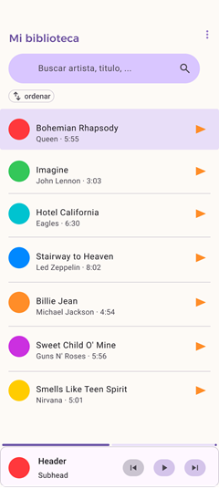
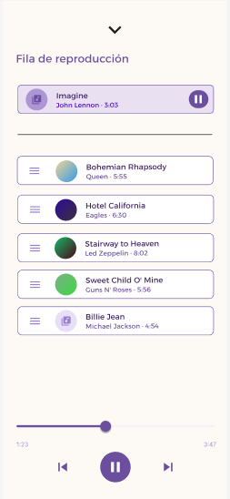

[README.md](https://github.com/user-attachments/files/28889161/README.md)
# Hush 🎵

Reproductor de música MP3 offline, simple y sin distracciones para Android.

## 📋 Descripción del problema

Las aplicaciones reproductoras de MP3 disponibles actualmente presentan varios problemas para el usuario común:

- **Publicidad invasiva**: anuncios intrusivos que interrumpen la experiencia de escucha.
- **Interfaces sobrecargadas**: demasiadas funciones, menús y opciones que dificultan el uso básico.
- **Permisos excesivos**: solicitan acceso a contactos, ubicación, redes sociales y otros datos innecesarios para reproducir música.
- **Dependencia de internet**: muchas requieren conexión constante para mostrar contenido, anuncios o sincronización, afectando a usuarios que solo desean escuchar su música local.

## 🎯 Objetivo de la aplicación

Hush ofrece una alternativa minimalista: un reproductor MP3 **100% offline**, **sin publicidad**, con una interfaz reducida a tres pantallas principales (biblioteca, reproductor y fila de reproducción). La aplicación escanea automáticamente los archivos de audio almacenados en el dispositivo y proporciona controles básicos de reproducción (play, pausa, siguiente, anterior), permitiendo además navegar entre pantallas sin interrumpir la música en curso.

## 📖 Historias de usuario del MVP

### HU-01
**Como** usuario con biblioteca de música local,
**quiero** que la app escanee automáticamente el almacenamiento y liste todos los MP3 con título y artista,
**para** encontrar mi música sin buscar manualmente.

### HU-02
**Como** usuario en reproducción activa,
**quiero** controles de play, pausa, siguiente y anterior accesibles desde el reproductor,
**para** gestionar la reproducción sin interrumpir lo que hago.

### HU-04
**Como** usuario multitarea,
**quiero** poder cambiar entre la lista de canciones y el reproductor sin que la reproducción se detenga,
**para** seguir escuchando mientras navego en la app.

## 🛠️ Tecnología utilizada

- **Lenguaje**: Kotlin
- **IDE**: Android Studio
- **Arquitectura**: MVVM (Model-View-ViewModel)
- **Jetpack Components**: ViewModel, LiveData / StateFlow
- **Reproducción de audio**: ExoPlayer
- **Escaneo de archivos**: MediaStore API
- **Persistencia / caché**: Room
- **Concurrencia**: Corrutinas de Kotlin
- **Inyección de dependencias**: Hilt

## 🚀 Instalación

Sigue estos pasos para ejecutar el proyecto localmente:

1. Clona el repositorio:
   ```bash
   git clone https://github.com/tu-usuario/hush.git
   ```
2. Abre el proyecto en **Android Studio**.
3. Sincroniza las dependencias de **Gradle** (Android Studio lo solicitará automáticamente al abrir el proyecto).
4. Conecta un dispositivo físico o inicia un emulador con **API 29 o superior**.
5. Ejecuta la aplicación pulsando **Run ▶️**.

## 📸 Capturas de pantalla

| Biblioteca                                | Reproductor                                | Fila de Reproduccion                                      |
|-------------------------------------------|--------------------------------------------|-----------------------------------------------------------|
|  |  |  |

## 📌 Estado actual del proyecto

El proyecto se encuentra en una etapa de **MVP funcional**, con las siguientes características implementadas:

- ✅ Escaneo automático de archivos MP3 del dispositivo.
- ✅ Listado de canciones (lista de reproducción) con título y artista.
- ✅ Reproducción continua de pistas.
- ✅ Barra de progreso interactiva.
- ✅ Navegación básica entre la biblioteca y el reproductor sin interrumpir la música.


## 📊 Historial de Commits

| Hash | Mensaje                                                            | Fecha |
|------|--------------------------------------------------------------------|-------|
| 09e60de | Actualizar README y mejorar UI                                     | 2026-06-26 |
| bef368f | feat(login): Implementar inicio de sesión y auto-login             | 2026-06-26 |
| 50620e3 | feat(register): Implementar registro de usuarios                   | 2026-06-26 |
| e747d80 | feat(auth): Implementar arquitectura de aut~~~~enticación con Firebase | 2026-06-26 |
| a15a61b | Actualización gitignore                                            | 2026-06-26 |
| cc33caf | Eliminar archivos que no deben estar en GitHub                     | 2026-06-26 |
| 4d18460 | Actualiza README y pantallas de la app                             | 2026-06-26 |
| 9f92cb8 | Merge branch 'master' de https://github.com/afpinzat/hush          | 2026-06-26 |
| c601467 | Agrega README y carpeta de screenshots                             | 2026-06-26 |
| 6145aa8 | Update README.md                                                   | 2026-06-26 |


### Próximas iteraciones

- 🔲 Creación y gestión de playlists personalizadas.
- 🔲 Mejoras en la funcionalidad de búsqueda dentro de la biblioteca.

---

*Hush — Escucha tu música, sin ruido.*
