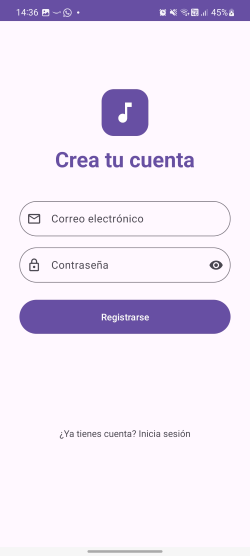
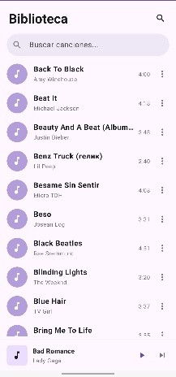
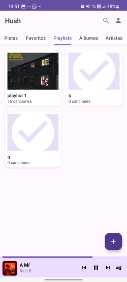
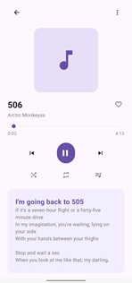

# Hush 🎵

Reproductor de música MP3 offline, simple y con una experiencia visual inmersiva para Android.

## 📋 Descripción del problema

Las aplicaciones reproductoras de MP3 disponibles actualmente presentan varios problemas para el usuario común:

- **Publicidad invasiva**: anuncios intrusivos que interrumpen la experiencia.
- **Interfaces sobrecargadas**: demasiadas funciones que dificultan el uso básico.
- **Dependencia de internet**: muchas requieren conexión constante para funcionar.

Hush resuelve esto ofreciendo un reproductor **100% offline**, **sin publicidad** y con un diseño moderno centrado en la música.

## 🎯 Objetivo de la aplicación

Hush ofrece una alternativa minimalista: un reproductor MP3 con una interfaz fluida basada en tres pilares: biblioteca, reproducción avanzada y gestión de listas. La aplicación utiliza efectos visuales dinámicos (partículas de humo) que reaccionan a la música y permite la gestión total de la biblioteca local, incluyendo letras sincronizadas (LRC).

## 📖 Historias de usuario

### HU-01: Escaneo Automático
**Como** usuario con música local, **quiero** que la app escanee mi almacenamiento, **para** encontrar mis temas sin buscarlos manualmente.

### HU-02: Control de Reproducción
**Como** usuario, **quiero** controles de play, pausa y salto de pista, **para** gestionar mi música fácilmente.

### HU-03: Organización Personalizada
**Como** usuario, **quiero** crear playlists y marcar favoritos, **para** organizar mi música según mi estado de ánimo.

### HU-04: Navegación Fluida
**Como** usuario, **quiero** cambiar de pantalla sin que la música se detenga, **para** navegar mientras escucho.

### HU-05: Seguridad y Acceso
**Como** usuario, **quiero** registrarme e iniciar sesión con Firebase, **para** mantener mi sesión segura.

## 🛠️ Tecnología utilizada

- **Lenguaje**: Kotlin (2.2.10)
- **Arquitectura**: MVVM + Clean Architecture
- **Persistencia**: Room (v2.8.4) & DataStore
- **Nube**: Firebase Auth (v33.15.0)
- **Reproducción**: Media3 ExoPlayer (v1.3.1)
- **Imágenes**: Coil (v2.6.0) con Hardware Bitmaps
- **DI**: Dagger Hilt (v2.57)

## 📋 CRUD Completo

| Operación | Entidad | Pantalla |
|-----------|----------|----------|
| **Create** | Playlist / Letras | Playlists / NowPlaying |
| **Read** | Biblioteca / Álbumes | Library / Details |
| **Update** | Canciones / Letras | NowPlaying |
| **Delete** | Playlist / Canciones | Playlists / Details |

## 🚀 Instalación y Requisitos

1. Clonar el repositorio:
   ```bash
   git clone https://github.com/afpinzat/hush.git
   ```
2. Abrir el proyecto en **Android Studio**.
3. Incluir tu archivo `google-services.json` en `app/`.
4. Sincronizar Gradle.
5. Iniciar un emulador o dispositivo con **API 24 o superior**.
6. Ejecutar la aplicación pulsando **Run ▶️**.

## 📸 Capturas de pantalla

| Login | Biblioteca | Playlists | Reproductor |
|-------|------------|-----------|-------------|
|  |  |  |  |

## 📚 Documentación

Para más detalles técnicos y de usuario, consulta los siguientes manuales:
- [📄 Manual Técnico (Markdown)](TECHNICAL_MANUAL.md)
- [📕 Manual de Usuario (PDF)](MANUAL%20DE%20USUARIO%20HUSH.pdf)

## 📌 Estado del proyecto (v1.0)

✅ **Lanzamiento v1.0 finalizado.** Todas las funcionalidades del MVP están implementadas y optimizadas para alto rendimiento (scroll fluido y bajo consumo de RAM).

---
*Hush — Tu música, sin distracciones.*
